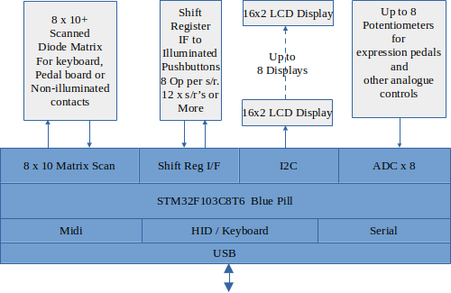

# USB Midi HID Pedalboard

## Introduction

This project was conceived to connect controls to Virtual Pipe Organ software such as Hauptwerk, Grande Orgue, Cecilia etc running on a touch screen laptop. The design uses an inexpensive microcontroller board with few external components. Flexibility is the main motivation as I started with little Midi or VPO experience. This project may work for you too. Let me know how you get on and whether improvements should be made.
## Block Diagram

## Features
- Hosted on the STM32 Blue Pill, a $2US development board
- USB Connection to host computer, LED blink on Midi activity
- Multiple STM32 boards may be deployed to ease wiring or increase capacity
- 80 scanned contacts arranged as a 8 input x 10 output diode switch matrix
- Contacts may send Midi Note On/Off messages for pedalboard, stops, couplers or toe pistons
- Contacts may instead send Keyboard HID messages for turning music pages displayed on a host computer monitor
- Page turning may use a single sustain pedal type contact e.g. short press forward, long press back.
- Contacts and potentiometers are individually debounced for 50ms to reduce message floods
- Tested using Arduino V1.8.19 with STM32 extensions under Ubuntu 22.04 X86 & Arm Linux
- Active High Outputs for the best noise immunity connect to inputs via a diode and switch: 
-   Output-----|>|---Switch----Input
- Up to 8 ADC inputs may be used for expression pedals and other purposes.
- Up to 8 I2C 16 x 2 line LCDs show their auto detected i2c address at power on.
## Current Configuration
- 80 Pedalboard inputs in 10x8 matrix mapped to Midi Channel 3/4 Note 36-67 (C2-G4) and 4 HID keybd buttons for page turning
- 96 Button & LED Shift register IO's mapped to Midi Channels 5-8 Notes 1-24 for pistons or stops
-  8 Filter ADC inputs are mapped to Channel 9 Midi CC 20-27 values 0-127 for expression pedals and LED dimming
-  I2C Display addresses are configured by PCF8574 solder bridge inputs on the LCD modules, these addresses are then configured in Hauptwerk and map through the blue pill. Expect address 0x38-0x3f for Philips/NXP ICs and 0x20-0x27 for TI. The highest address is used when no solder bridges are fitted.

## Initial Midi Channel Assignments

Initial midi channel assignments are readily altered by editing constant arrays.

|         |Notes|Pistons|Expression|
| :---:   |:---:| :---: |  :---:   |
| Manual1 |  1  |   5   |          |
| Manual2 |  2  |   6   |          |
| Manual3 |  3  |   7   |          |
| Pedal   |  4  |   8   |     9    |

### *** RE-PROGRAMMING ***
 * The firmware is configured to use the reserved gpio pins, the Blue Pill may be tricky to re-program.
 * To re-program if you have problems:
 * 1. Set Boot0 Link to position 1
 * 2. Press reset
 * 3. Upon releasing reset immediately upload new code using ST-Link
 * 4. Repeat step 3 until programming success
 * 5. Move Boot0 link to position 0
 * 6. Disconnect programmer
 * 7. OR Use a USB boot loader
## Enhancements
- Output drive for LEDs and displays possibly midi controlled may be needed
 ## Thanks
The code is based on the excellent examples from: https://github.com/arpruss/USBComposite_stm32f1/tree/master/examples
Also thanks to the Arduino and STM32 support teams
# License
MIT
